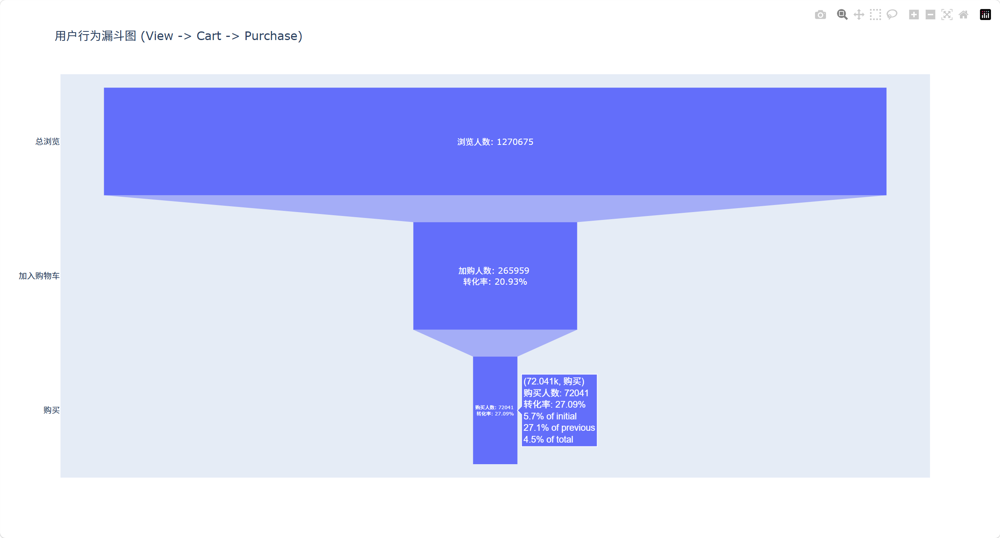
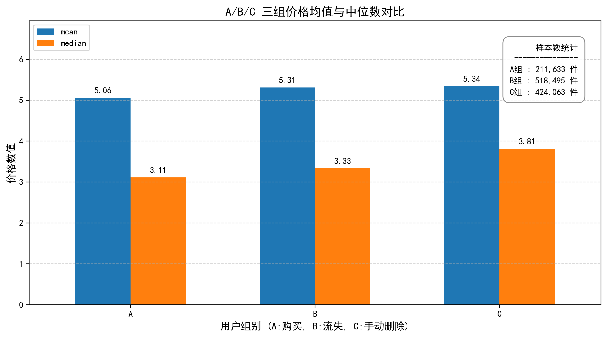
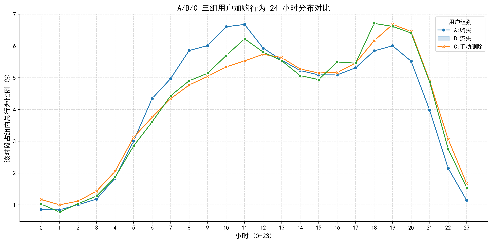

# 📊 电商用户行为分析：购物车流失 AB 对比研究

## 🎯 项目目标

**核心问题**：为什么用户加购后不购买？通过对比"转化用户"和"流失用户"的行为特征，找出提升转化率的关键因素。

**分析维度**：购物车流失率

---

## 📈 数据集概览

- **数据来源**：Kaggle - Ecommerce Events History (Cosmetics Shop)
- **时间范围**：2019年12月
- **数据规模**：100万+ 行事件记录，400MB
- **核心字段**：
  - `event_type`：用户行为类型（view/cart/remove_from_cart/purchase）
  - `user_id` / `user_session`：用户标识
  - `product_id` / `category_code` / `brand`：商品信息
  - `price`：商品价格
  - `event_time`：事件时间戳

---

## 🔍 初步发现（10000行样本）

| 加购（cart） | 92.7万 |
| 移出购物车 | 66.5万 |
| 购买（purchase） | 21.3万 |

**核心洞察**：加购用户只有23%最终完成购买，存在严重的购物车流失。

---

## 🚀 分析进展与深度洞察

### 1. 整体转化漏斗 (Funnel Analysis)

- **现象**：从浏览到加购的比例较高，但从加购到支付存在断层式流失。
- **结论**：通过漏斗验证，确认购物车环节是提升全站转化率的“胜负手”。

### 2. 价格维度：A/B 两组无显著差异

- **分析结论**：通过对比“转化用户”与“流失用户”的商品单价及总额，发现两组分布高度重合。
- **业务洞察**：**价格不是导致流失的核心原因**。用户并非因价格敏感而放弃，流失可能源于决策中断。

### 3. 时间维度：捕捉“流失高峰窗口”

- **加购高峰期 (5:00 - 12:00)**：该时段用户加购后转化意愿相对稳定。
- **流失高峰期 (16:00 - 次日4:00)**：该时段加购量依然不小，但支付转化率显著下降。
- **业务动作建议**：可以在下午 16 点左右针对购物车内有商品的活跃用户进行精准促活。

---

## 📊 分析计划（已完成阶段性验证）

### 宏观面：转化漏斗分析 (Funnel Analysis)

- **目标**：评估全站健康度，验证"最大流失环节是否发生在购物车"。
- **方法**：计算全局 `View (浏览) -> Cart (加购) -> Purchase (购买)` 的各层转化率。

### 微观面：购物车流失的类 A/B 对比分析 (A/B Testing Approach)

- **目标**：锁定购物车流失后，诊断其根本原因。
- **用户分群**：
  - **A组（转化用户）**：在同一 Session 内加购且成功购买。
  - **B组（流失用户）**：在同一 Session 内加购但未购买。
- **业务假设验证 (待分析)**：重点对比商品价格敏感度（越贵的商品是否流失率显著更高？）

### 统计检验

- AB对比的显著性检验（两独立样本 t-检验 / 卡方检验）

### 可视化呈现

- 宏观转化漏斗图 (Funnel Chart)
- A/B 价格分布差异箱线图 / 转化率差异条形图

---

## 🛠️ 技术栈

- **语言**：Python 3.x
- **库**：Pandas, NumPy, Scipy, Matplotlib/Seaborn
- **方法**：描述统计 + 假设检验

---

## ⚠️ 待决策项

1. **会话定义**：用同一个session内的行为，还是按用户整月行为？
2. **时间窗口**：转化用户的"购买"必须在加购后多少天内？
3. **对标维度**：重点对比品类 vs 价格 vs 时间？

---

## 👤 关于我

电商专业大二在读，目前处于"能看懂代码但不知道该分析什么"的阶段。  
用这个项目练习完整的电商数据分析流程：从数据探索 → 指标构建 → A/B对比 → 统计检验 → 可视化输出结论。

## 🤖 协作方式

本项目使用 **多 Agent 协作** 模式完成：

- **Claude Code（Sonnet 4.6）**：担任资深数据分析师角色，负责分析思路引导、指标选择、图表建议、报错排查
- **GitHub Copilot / OpenCode**：辅助生成代码片段，探索代码逻辑
- 人工审核 + 业务判断：所有 Agent 输出的结论由我（人类）做最终筛选和解释

> 这不是一个纯技术项目，更是一个"学会如何分析数据"的练习项目。

