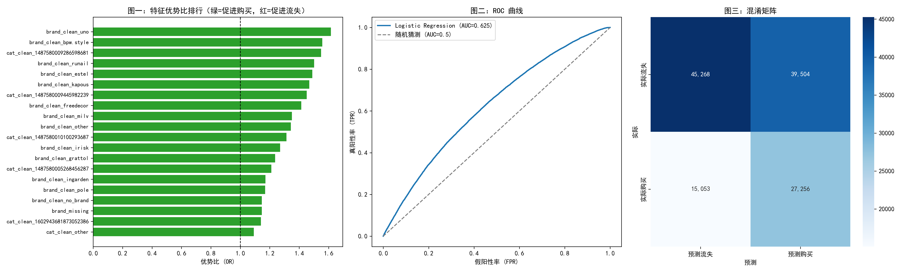
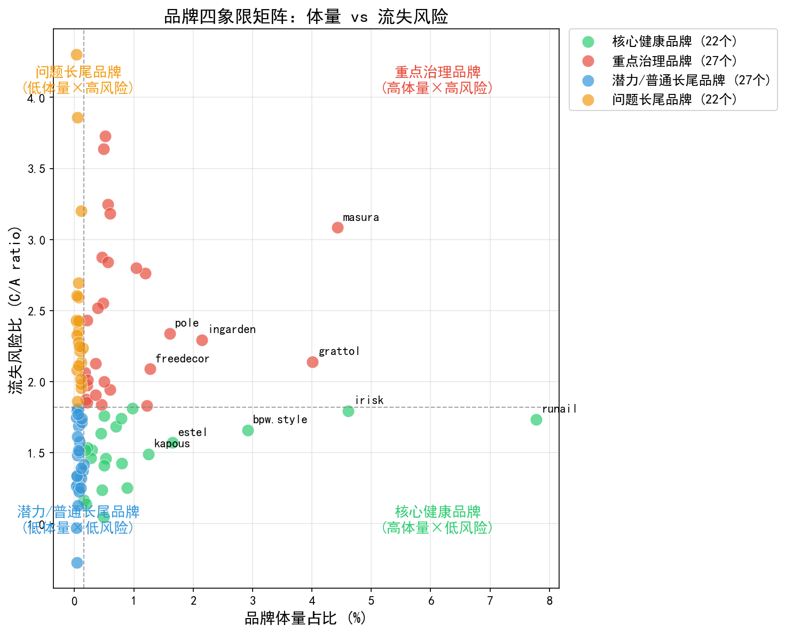

# 电商购物车流失分析：从“为什么不买”到品牌运营策略

## Executive Summary

- **这个项目研究的问题是：用户已经加购了，为什么最后没有购买？** 我把问题拆成价格、品牌、时间、行为特征几个可能解释，逐步验证哪些因素真正能解释购物车流失。
- **最稳定的结论是：价格不是主因，品牌差异更关键。** A 组购买用户、B 组被动流失用户、C 组主动移出购物车用户的平均价格很接近；但不同品牌的 C/A 风险比差异明显，同价位下 `masura` 的主动流失风险长期高于 `runail`。
- **时间会放大流失，但不是根因。** 晚上 18 点到次日 4 点更容易流失，早上 6 点到 11 点更容易购买；但 `masura` 在上午的流失风险仍高于 `runail` 在晚上的流失风险，说明品牌本身的差异比时间段更强。
- **建模部分最有价值的不是高分，而是识别了目标泄露。** 初版 Logistic Regression 的 ROC-AUC 达到 0.8428，但主要依赖 `session_remove_from_cart` 等事后字段；剔除泄露并只使用首次加购前行为后，ROC-AUC 降到 0.5773，说明真正可提前预测的信号还需要下沉到商品级行为。

---

## 问题是什么？

这个项目的核心问题是：

> 在电商化妆品场景中，用户已经把商品加入购物车，为什么仍然没有完成购买？

我没有把它简单写成“做一个用户行为分析”，而是把它拆成一个更接近业务的问题：

1. 购物车是不是主要流失环节？
2. 用户不买是不是因为价格太高？
3. 如果不是价格，是不是品牌、时间段或用户行为模式造成差异？
4. 哪些品牌应该被加大流量，哪些品牌应该重点治理？
5. 如果要做提前预警，现有数据能不能预测用户是否会购买？

项目最终希望回答的不是“哪个模型分数最高”，而是“运营应该把力气花在哪里”。

---

## 我怎么验证？

我的验证路线是“先定位问题，再逐步排除解释”。

### 1. 先用漏斗确认问题发生在哪里

先统计 `view`、`cart`、`remove_from_cart`、`purchase` 的行为链路，确认用户不是没有兴趣，而是在加购后大量流失。


从中间表口径看，A/B/C 三类结果样本分别为：

| 分组 | 含义 | 样本量 |
|---|---|---:|
| A | 加购后购买 | 211,633 |
| B | 加购后未购买、也未主动移出购物车 | 518,495 |
| C | 加购后主动移出购物车 | 424,063 |

这个结果把分析方向锁定在“加购后的转化/流失”，而不是泛泛分析全站浏览行为。

### 2. 再看价格，验证“是不是卖贵了”

我对比了 A/B/C 三组的价格分布：

| 分组 | 平均价格 | 中位数价格 |
|---|---:|---:|
| A 购买 | 5.06 | 3.11 |
| B 被动流失 | 5.31 | 3.33 |
| C 主动流失 | 5.34 | 3.81 |


三组价格差异存在，但不大，价格分布高度重合。因此我没有把“价格太高”当成主结论，而是把它作为一个被削弱的解释。

### 3. 然后看品牌，寻找稳定差异

价格解释不够强之后，我转向品牌维度，比较购买组和流失组的品牌结构。


关键发现是：不同品牌在 A 组和 C 组中的占比差异明显。

- `runail` 在 A 组占比 8.54%，在 C 组占比 7.39%，更偏向购买。
- `masura` 在 A 组占比 3.26%，在 C 组占比 5.02%，更偏向主动流失。
- `estel`、`kapous` 等品牌也更偏健康；`bluesky`、`cosmoprofi` 等品牌更偏高风险。

这一步把问题从“用户为什么不买”推进到“哪些品牌更容易让用户放弃购买”。

### 4. 用时间交叉验证，避免把时间误判成品牌

前面发现购买高峰更集中在早上，流失高峰更集中在晚上。为了验证品牌结论是不是被时间段干扰，我对 `masura` 和 `runail` 做了品牌 × 小时 × 分组交叉分析。


关键对比：

| 品牌 | 时段 | A 组占比 | C 组占比 | C/A 风险比 |
|---|---:|---:|---:|---:|
| masura | 上午 8-11 点 | 17.06% | 42.88% | 2.51 |
| masura | 晚上 18-21 点 | 13.06% | 44.02% | 3.37 |
| runail | 上午 8-11 点 | 22.34% | 34.40% | 1.54 |
| runail | 晚上 18-21 点 | 18.04% | 34.78% | 1.93 |

时间确实有影响：同一品牌晚上更容易流失。但 `masura` 在最好时段的风险比 2.51，仍高于 `runail` 在最差时段的 1.93。  
所以我把时间定义为“加剧因素”，不是根因。

### 5. 控制价格后再看品牌，验证“同价不同命”

为了进一步排除价格干扰，我把 `masura` 和 `runail` 放在同一价格带里比较。


| 价格带 | masura C/A | runail C/A | 解释 |
|---|---:|---:|---|
| 0-3 | 2.98 | 1.67 | 同低价段，masura 仍更容易流失 |
| 3-6 | 3.72 | 1.96 | masura 风险约为 runail 的 1.9 倍 |
| 6-10 | 2.55 | 1.80 | 风险差距仍存在 |
| 10-15 | 6.10 | 1.49 | masura 高溢价段流失风险明显放大，但样本较小 |

这一步是项目里比较关键的验证：即使价格相近，品牌之间的流失差异依然存在。  
因此“品牌自身的产品力、口碑、替代品竞争、用户信任感”比单纯价格更值得关注。

### 6. 用 Logistic Regression 做量化验证，并识别目标泄露

我用 Logistic Regression 预测“加购后是否购买”，把 A 组作为购买样本，C 组作为主动流失样本，剔除结果不明确的 B 组。



初版模型加入整段 session 行为特征后：

| 指标 | 数值 |
|---|---:|
| Accuracy | 0.7986 |
| ROC-AUC | 0.8428 |
| 测试样本 | 127,081 |

但复盘字段后发现，`session_remove_from_cart`、`session_cart_remove_ratio` 等字段统计的是整段 session，其中包含了结果发生后的行为。这些字段和 C 组定义高度重叠，存在目标泄露。

所以我做了第二轮验证：

1. 删除明显泄露字段后，AUC 从 0.8428 降到 0.6245。
2. 重新构造“首次加购前”的 pre-cart 特征，只使用第一次 `cart` 事件之前的浏览行为。
3. 使用品牌、价格、品类和 8 个 pre-cart 特征重新建模，ROC-AUC 为 0.5773，只比纯商品属性模型 AUC 0.5707 略高。

这个结果说明：如果目标是提前预警，session 级浏览行为的预测力有限；下一步应把特征粒度下沉到“被加购商品本身”，例如该商品加购前是否被浏览过、浏览到加购间隔多久。

---

## 用了什么数据？

### 原始数据

- 数据来源：Kaggle - Ecommerce Events History in Cosmetics Shop
- 时间范围：2019 年 12 月
- 原始文件：`data/raw/Dec.csv`
- 文件大小：约 415 MB
- 事件类型：`view`、`cart`、`remove_from_cart`、`purchase`
- 核心字段：
  - `event_time`：事件时间
  - `event_type`：行为类型
  - `product_id`：商品 ID
  - `category_id` / `category_code`：品类信息
  - `brand`：品牌
  - `price`：价格
  - `user_id` / `user_session`：用户与会话标识

### 分析中间表

| 文件 | 作用 |
|---|---|
| `data/interim/03_user_behavior_groups.csv` | 主分析表，按 `user_session × product_id` 聚合并标记 A/B/C 分组 |
| `data/interim/03_price_stats.csv` | A/B/C 三组价格统计 |
| `data/interim/03_time_summary_point.csv` | A/B/C 三组小时分布 |
| `data/interim/04_abc_brand_analysis.csv` | 品牌在 A/B/C 三组中的占比 |
| `data/interim/05_brand_time_cross_analysis.csv` | 品牌 × 小时 × 分组交叉验证 |
| `data/interim/06_price_brand_group_analysis.csv` | `masura` 与 `runail` 在不同价格带的风险对比 |
| `data/interim/08_session_features.csv` | 整段 session 行为特征，用于初版建模，存在事后字段 |
| `data/interim/09_pre_cart_features.csv` | 首次加购前 session 特征，用于剔除目标泄露后的复测 |
| `data/interim/10_brand_quadrant_matrix.csv` | 品牌四象限分层结果 |

### A/B/C 分组口径

| 分组 | 业务含义 | 解释 |
|---|---|---|
| A | 购买用户/商品 | 加购后最终购买 |
| B | 被动流失 | 加购后没有购买，但也没有主动移出购物车 |
| C | 主动流失 | 加购后主动 `remove_from_cart` |

其中 A 和 C 是结果最明确的两组，所以建模时主要使用 A/C 做二分类，B 组更多用于描述整体流失结构。

---

## 为什么这么做？

### 1. 因为业务问题需要“排除法”，不是只看相关性

如果只看一张价格图、品牌图或模型结果，很容易得出过早结论。  
所以我采用的是：

1. 用漏斗锁定问题环节。
2. 用价格对比排除最直觉的解释。
3. 用品牌分组寻找更稳定的差异。
4. 用时间交叉验证确认品牌差异不是时间造成的。
5. 用控制价格后的品牌对比确认“同价不同命”。
6. 用建模量化影响，但同时检查字段是否泄露。

这条路线的重点是让结论经得起追问。

### 2. 因为购物车流失是一个运营问题

购物车流失不是单纯预测问题。业务真正关心的是：

- 哪些用户值得挽回？
- 哪些品牌应该给更多曝光？
- 哪些品牌虽然有流量但转化差，需要治理？
- 什么时间点适合提醒？
- 如果模型要上线，预测时点之前到底能看到哪些字段？

所以我没有只停留在模型分数，而是把每个发现翻译成可行动的运营策略。

### 3. 因为“目标泄露”本身就是数据分析能力的体现

初版模型 AUC 很高，但字段里包含移出购物车次数，这相当于在预测“是否流失”时偷看了“是否已经移出购物车”。  
发现并修正这个问题，比保留一个漂亮但不可信的高分更重要。

这也是这个项目可以讲给面试官听的地方：我不仅会跑模型，也会判断模型结果能不能在真实业务中使用。

---

## 发现了什么？

### 发现 1：购物车是主要流失环节

用户不是完全没有兴趣，而是在加购之后没有完成购买。A/B/C 分组中，明确购买样本 211,633，主动移出购物车样本 424,063，主动流失规模明显大于购买规模。

业务解释：加购后的提醒、优惠、品牌信任建设和商品详情优化，比单纯拉更多浏览流量更可能带来转化提升。

### 发现 2：价格不是最主要的流失解释

A 组平均价格 5.06，C 组平均价格 5.34；中位数分别为 3.11 和 3.81。流失组价格略高，但差异不足以解释大规模流失。

业务解释：不能简单把流失归因于“太贵了”，否则容易误用降价策略。更应该继续追查品牌、品类、用户决策过程。

### 发现 3：品牌差异比价格差异更稳定

`runail`、`estel`、`kapous` 等品牌更偏购买；`masura`、`bluesky`、`cosmoprofi` 等品牌更偏主动流失。

业务解释：品牌不是一个普通维度，它可能综合反映产品力、用户信任、评价、替代品竞争和品牌溢价能力。

### 发现 4：时间影响转化，但不是根因

购买更集中在早上 6-11 点，流失更集中在晚上 18 点到次日 4 点。  
但品牌交叉验证显示，`masura` 在上午的风险仍高于 `runail` 在晚上。

业务解释：时间适合用来优化触达时机，但不能替代品牌治理。比如 16 点前后可以作为购物车提醒窗口，但高风险品牌仍需要单独策略。

### 发现 5：控制价格后，品牌差异仍然存在

在 0-3、3-6、6-10 等主力价格带内，`masura` 的 C/A 风险比都高于 `runail`。  
尤其在 10-15 元价格带，`masura` C/A 达到 6.10，说明它在高溢价区更容易被用户放弃。

业务解释：某些品牌缺乏溢价能力。对这类品牌，盲目提价会放大流失；更适合通过赠品、评价强化、组合销售或降权治理来处理。

### 发现 6：品牌可以分成四类运营

基于品牌体量和流失风险，我把品牌分成四象限：

| 象限 | 代表品牌 | 业务含义 |
|---|---|---|
| 核心健康品牌 | `runail`、`irisk`、`bpw.style` | 高体量、相对低风险，是 GMV 确定性来源 |
| 重点治理品牌 | `masura`、`grattol`、`ingarden` | 高体量、高风险，需要加购挽回和详情页治理 |
| 潜力长尾品牌 | `kaaral`、`benovy`、`skinlite` | 低体量、低风险，可小流量测试放量 |
| 问题长尾品牌 | `shik`、`beauty-free`、`ecolab` | 低体量、高风险，优先级最低，可降低推荐权重 |



业务解释：这个分层可以直接服务于流量分配、品牌治理和运营优先级排序。

### 发现 7：模型高分不等于可用，预测时点很关键

初版模型 ROC-AUC 0.8428，但存在目标泄露；剔除泄露并只使用首次加购前行为后，ROC-AUC 只有 0.5773。

业务解释：如果只是做事后复盘，整段 session 特征有解释价值；如果要做提前预警，就只能使用预测时点之前可见的字段。下一步应该构造商品级 pre-cart 特征，而不是继续堆 session 级特征。

---

## 对业务有什么意义？

### 1. 运营策略从“全量促销”变成“品牌分层治理”

如果只知道购物车流失严重，常见动作是全量发券。  
但这个项目说明，不同品牌的流失风险差异很大，应该按品牌分层做策略：

- 核心健康品牌：增加搜索、推荐、首页曝光，放大确定性转化。
- 重点治理品牌：在加购后增加限时券、评价露出、替代品推荐或详情页优化。
- 潜力长尾品牌：小流量测试，看是否能从低体量放大到高体量。
- 问题长尾品牌：减少资源投入，避免占用推荐位。

### 2. 价格策略不应一刀切

价格不是整体流失的主因，但对弱品牌的高价段有放大作用。  
因此更合理的策略不是全站降价，而是：

- 对高风险品牌控制高溢价定价。
- 对 10-15 元高风险价格带做赠品或组合销售。
- 对健康品牌保留一定溢价空间，避免不必要降价。

### 3. 时间可以用于触达，但不能替代商品治理

流失高峰集中在晚上，说明提醒时机有优化空间。  
比较实用的动作是：在下午 16 点左右识别购物车内仍有商品的活跃用户，在晚间流失高峰前做提醒或优惠触达。

但时间只是触达窗口，不是根因。真正的优先级仍然应该结合品牌风险。

### 4. 建模方向从“事后识别”转向“提前预警”

项目后半段最大的收获是明确了预测时点：

- 如果用整段 session 字段，可以识别“谁已经表现出流失迹象”。
- 如果要提前预警，只能使用首次加购之前的行为。
- session 级 pre-cart 特征预测力弱，下一步应该做商品级 pre-cart 特征。

这让后续项目方向更清楚：不是继续追求模型分数，而是重新设计业务可用的特征。

---

## 如果面试讲 10 分钟，可以这样讲

1. **先讲问题**：我研究的是化妆品电商里用户加购后不购买的问题，希望找出流失原因和运营干预点。
2. **讲数据和口径**：数据来自 Kaggle 2019 年 12 月事件日志，我按 `user_session × product_id` 聚合，把加购后的结果分成购买 A、被动流失 B、主动流失 C。
3. **讲验证路径**：先用漏斗确认购物车是流失环节，再用价格、品牌、时间、控制价格对比逐步排除和验证。
4. **讲核心发现**：价格差异不大，品牌差异最稳定；时间会放大流失但不是根因；同价位下 `masura` 比 `runail` 更容易流失。
5. **讲建模反思**：初版 Logistic Regression AUC 0.8428，但发现使用了事后字段，存在目标泄露；重做 pre-cart 特征后 AUC 0.5773，说明真正可提前预测的行为信号还不够。
6. **讲业务意义**：品牌应分层运营，健康品牌加流量，高风险品牌做加购挽回和详情页治理，弱品牌高价段要谨慎。
7. **讲下一步**：从 session 粒度下沉到商品级特征，比如首次加购商品之前是否被浏览、浏览到加购的间隔，以提高提前预警能力。

---

## 项目结构

```text
eCommerce_Events_History/
├── data/
│   ├── raw/
│   │   └── Dec.csv
│   └── interim/
│       ├── 03_user_behavior_groups.csv
│       ├── 03_price_stats.csv
│       ├── 03_time_summary_point.csv
│       ├── 04_abc_brand_analysis.csv
│       ├── 05_brand_time_cross_analysis.csv
│       ├── 06_price_brand_group_analysis.csv
│       ├── 08_session_features.csv
│       ├── 09_pre_cart_features.csv
│       └── 10_brand_quadrant_matrix.csv
├── notebooks/
│   ├── 01_查看表格.ipynb
│   ├── 02_浏览加入购物车购买转化.ipynb
│   ├── 03_ab入购行为对比.ipynb
│   ├── 04_abc品牌维度分析.ipynb
│   ├── 05_品牌时间交叉分析me.ipynb
│   ├── 06_r品牌与m品牌价格品类流失分析.ipynb
│   ├── 07_项目总结与业务建议.ipynb
│   ├── 08_logistic_regression建模分析.ipynb
│   ├── 09_logistic_regression建模复习.ipynb
│   └── 10_品牌四象限矩阵.ipynb
├── reports/
│   ├── 02_user_funnel.png
│   ├── 03_price_metrics_comparison.png
│   ├── 03_time_point_distribution1.png
│   ├── 05_brand_time_cross_analysis.png
│   ├── 06_price_brand_group_analysis.png
│   ├── 07_brand_abc_stacked_bar.png
│   ├── 07_brand_risk_ratio.png
│   ├── 08_logistic_regression_results.png
│   ├── 10_brand_quadrant_matrix.png
│   └── user_funnel.html
├── README.md
├── worklog.md
└── requirements.txt
```

---

## 技术栈和方法

- Python
- Pandas / NumPy
- Matplotlib / Seaborn / Plotly
- Scikit-learn
- 漏斗分析
- A/B/C 分组对比
- 品牌结构分析
- 时间交叉分析
- 控制变量对比
- Logistic Regression
- 目标泄露检查

---

## 局限性

1. 数据只覆盖 2019 年 12 月，无法判断长期趋势和季节性。
2. 数据来自化妆品品类，结论不一定能直接迁移到其他品类。
3. 缺少用户画像、评价、库存、优惠券、广告曝光、搜索词等上下文。
4. A/B/C 分组是基于行为结果构造的分析口径，不等同于严格因果实验。
5. 初版模型存在目标泄露，已在复测中识别并修正，但也说明模型上线前必须重新定义预测时点。
6. pre-cart session 特征粒度偏粗，同一个 session 下多个商品共享同一组特征，后续应构造商品级行为特征。

---

## 当前项目状态

这个项目已经可以作为一个完整的数据分析实习作品来讲：

- 有明确业务问题。
- 有可解释的数据口径。
- 有逐步验证和排除过程。
- 有图表和中间数据支撑。
- 有业务建议。
- 有对模型目标泄露的反思。
- 有清楚的下一步改进方向。

下一步最值得推进的是：围绕“首次加购商品”构造商品级 pre-cart 特征，把问题从“session 是否有购买倾向”推进到“用户对这个具体商品是否有足够购买意图”。
