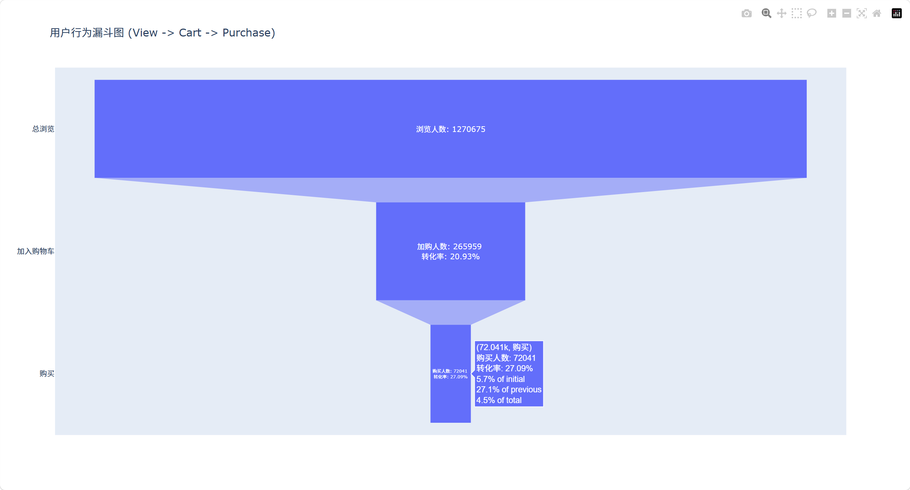
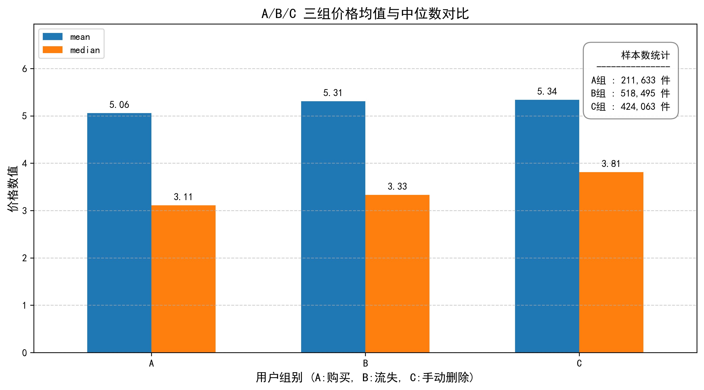
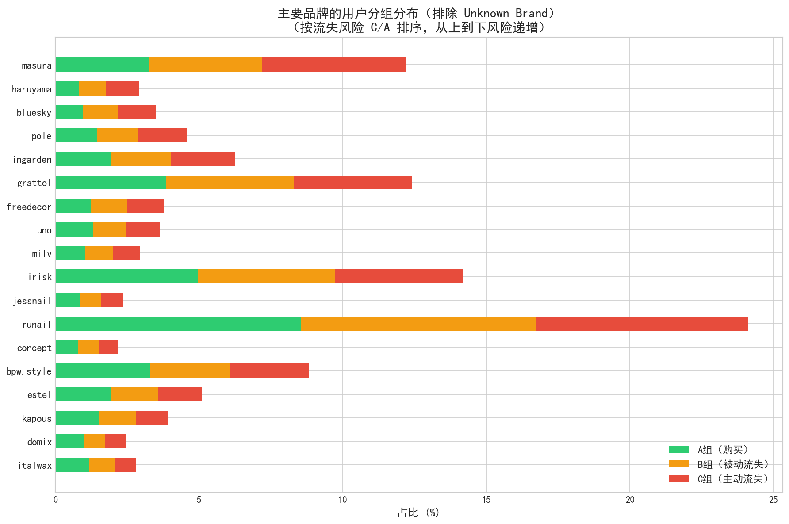
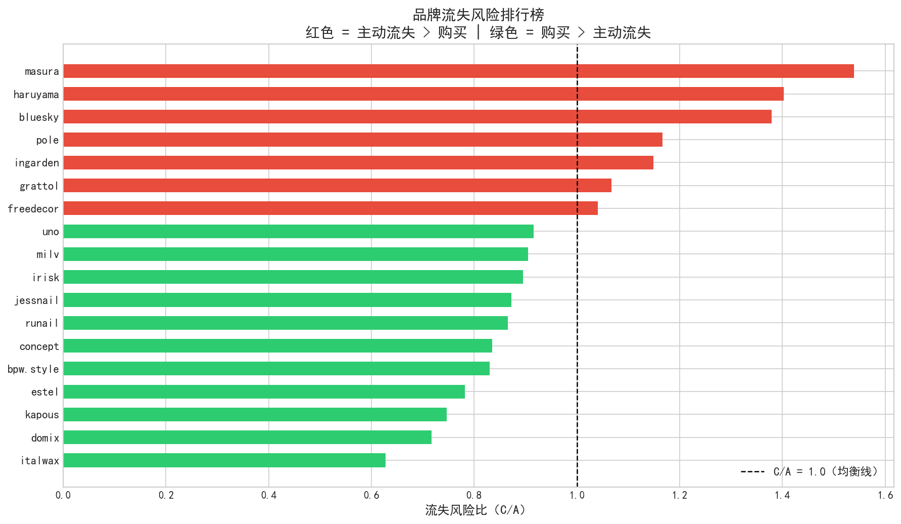
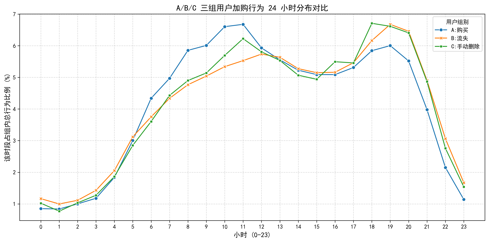
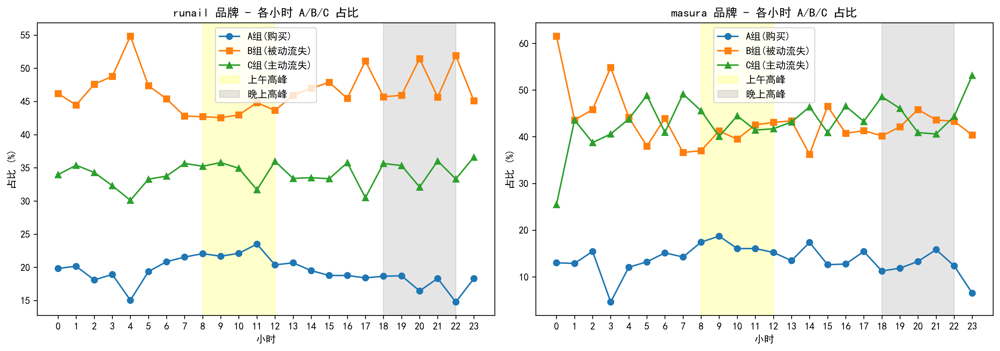
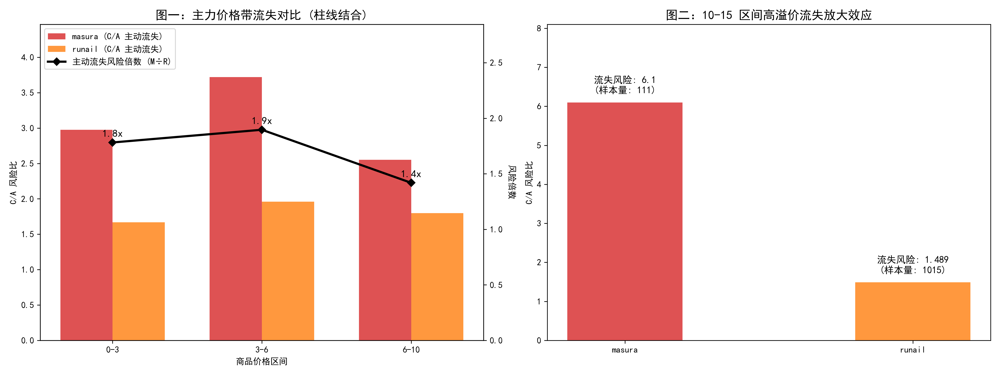

# 📊 电商用户行为分析：购物车流失 AB 对比研究

## 🎯 项目目标

**核心问题**：为什么用户加购后不购买？通过对比"转化用户"和"流失用户"的行为特征，找出提升转化率的关键因素。

**分析维度**：购物车流失率

---

## 📈 数据集概览

- **数据来源**：Kaggle - Ecommerce Events History (Cosmetics Shop)
- **时间范围**：2019年12月
- **数据规模**：100万+ 行事件记录，400MB
- **核心字段**：
  - `event_type`：用户行为类型（view/cart/remove_from_cart/purchase）
  - `user_id` / `user_session`：用户标识
  - `product_id` / `category_code` / `brand`：商品信息
  - `price`：商品价格
  - `event_time`：事件时间戳

---

## 🔍 初步发现（10000行样本）

| 加购（cart） | 92.7万 |
| 移出购物车 | 66.5万 |
| 购买（purchase） | 21.3万 |

**核心洞察**：加购用户只有23%最终完成购买，存在严重的购物车流失。

---

## 🚀 分析进展与深度洞察

### 1. 整体转化漏斗 (Funnel Analysis)



- **现象**：从浏览到加购的比例较高，但从加购到支付存在断层式流失。
- **结论**：通过漏斗验证，确认购物车环节是提升全站转化率的”胜负手”。

### 2. 价格维度：A/B 两组无显著差异



- **分析结论**：通过对比”转化用户”与”流失用户”的商品单价及总额，发现两组分布高度重合。
- **业务洞察**：**价格不是导致流失的核心原因**。用户并非因价格敏感而放弃，流失可能源于决策中断。

### 3. 品牌维度：流失的根本差异因素




- **分析结论**：不同品牌的流失命运截然不同。
  - **健康品牌（C/A < 1）**：`runail`、`estel`、`kapous` 等，买的人比弃的人多
  - **危险品牌（C/A > 1）**：`masura`、`bluesky`、`cosmoprofi` 等，弃的人比买的人还多
- **业务洞察**：**品牌自身的特征（产品力、口碑、竞品替代性）是决定用户是否最终购买的关键因素。**

### 4. 时间 × 品牌交叉验证：时间是加剧因素，非根因




- **时间分布规律**：购买高峰在早上 6-11 点，流失高峰在晚上 18 点 - 次日 4 点。
- **交叉验证**：`masura` 在最好时段（上午）的流失风险（C/A = 2.51），仍高于 `runail` 在最差时段（晚上）的 1.93。
- **业务洞察**：时间确实影响转化率，但**品牌本身的差异比时间更大**。

### 5. 同价不同命：品牌护城河确实存在



- **分析结论**：控制价格后，`masura` 在同一价格带内的流失率稳定是 `runail` 的 **1.5 倍**。高溢价区（10-15元）流失风险比飙升至 **6.1**。
- **业务洞察**：价格相同，命运不同——问题出在品牌的产品力、评价、平替竞争等综合因素上。

---

## 📋 核心结论

| # | 发现 | 方法 | 排除/锁定 |
|---|------|------|----------|
| 1 | 购物车是最大流失黑洞 | 漏斗分析 | 锁定分析方向 |
| 2 | 价格不是流失原因 | AB组价格分布对比 | ❌ 排除价格 |
| 3 | 品牌是根本差异 | ABC品牌分组分析 | ✅ 锁定品牌 |
| 4 | 时间是影响因素但非根因 | 品牌×时间交叉分析 | ⚠️ 时间有影响，但非主因 |
| 5 | 同价不同命，品牌护城河存在 | 控制价格后的品牌对比 | ✅ 确认品牌本身特征 |

## 💡 业务建议

1. **高流失品牌实施”加购挽回”**：对 `masura`、`bluesky` 等 C/A > 1 的品牌，用户加购后 2 小时内推送限时优惠券
2. **健康品牌加大流量投入**：对 `runail`、`estel` 等 C/A < 1 的品牌，在首页推荐和搜索结果中提升权重——这些品牌”给流量就能转化”
3. **16 点是精准促活的黄金窗口**：在下午 16:00 左右对购物车内有商品的活跃用户推送提醒，赶在流失高峰前截胡
4. **控制弱品牌定价**：对缺乏品牌溢价能力的商品控制定价在 10 元以下，或搭配赠品提升感知价值

---

## 📂 项目结构

```
eCommerce_Events_History/
├── data/
│   ├── raw/              # 原始数据（Dec.csv）
│   └── interim/          # 清洗后的中间数据
│       ├── 03_user_behavior_groups.csv   # ABC分组数据
│       ├── 04_abc_brand_analysis.csv     # 品牌ABC分析
│       ├── 05_brand_time_cross_analysis.csv
│       └── 06_price_brand_group_analysis.csv
├── notebooks/
│   ├── 01_查看表格.ipynb
│   ├── 02_浏览加入购物车购买转化.ipynb
│   ├── 03_ab入购行为对比.ipynb
│   ├── 04_abc品牌维度分析.ipynb
│   ├── 05_品牌时间交叉分析me.ipynb
│   ├── 06_r品牌与m品牌价格品类流失分析.ipynb
│   └── 07_项目总结与业务建议.ipynb       # 总结报告
├── reports/              # 图表与报告
│   ├── 02_user_funnel.png
│   ├── 03_price_metrics_comparison.png
│   ├── 03_time_point_distribution1.png
│   ├── 05_brand_time_cross_analysis.png
│   ├── 05_brand_period_analysis.png
│   ├── 06_price_brand_group_analysis.png
│   ├── 07_brand_abc_stacked_bar.png
│   ├── 07_brand_risk_ratio.png
│   └── final_report.md
├── README.md
├── worklog.md
└── requirements.txt
```

---

## 🛠️ 技术栈

- **语言**：Python 3.x
- **库**：Pandas, NumPy, Scipy, Matplotlib/Seaborn, Plotly
- **方法**：描述统计 + 交叉分析 + 排除法

---

## ⚠️ 局限性

1. 数据仅覆盖 2019 年 12 月一个月，无法观察长期趋势
2. 品类单一（化妆品），结论不一定适用于其他品类
3. 缺少用户画像（年龄/性别/地域）和评价数据
4. 未对品牌差异做统计显著性检验

---

## 👤 关于我

电商专业大二在读，目前处于"能看懂代码但不知道该分析什么"的阶段。  
用这个项目练习完整的电商数据分析流程：从数据探索 → 指标构建 → A/B对比 → 统计检验 → 可视化输出结论。

## 🤖 协作方式

本项目使用 **多 Agent 协作** 模式完成：

- **Claude Code（Sonnet 4.6）**：担任资深数据分析师角色，负责分析思路引导、指标选择、图表建议、报错排查
- **GitHub Copilot / OpenCode**：辅助生成代码片段，探索代码逻辑
- 人工审核 + 业务判断：所有 Agent 输出的结论由我（人类）做最终筛选和解释

> 这不是一个纯技术项目，更是一个"学会如何分析数据"的练习项目。


